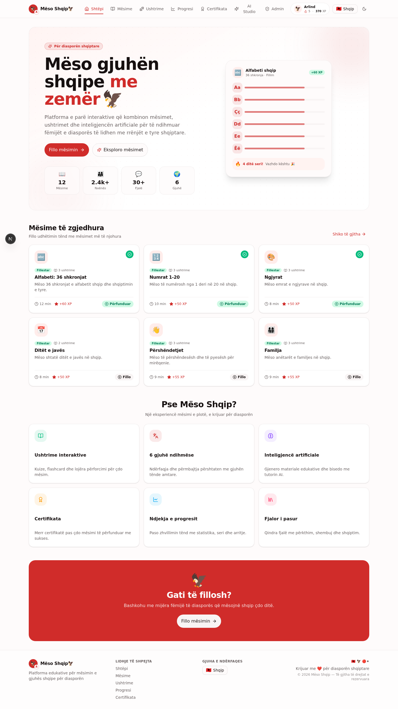
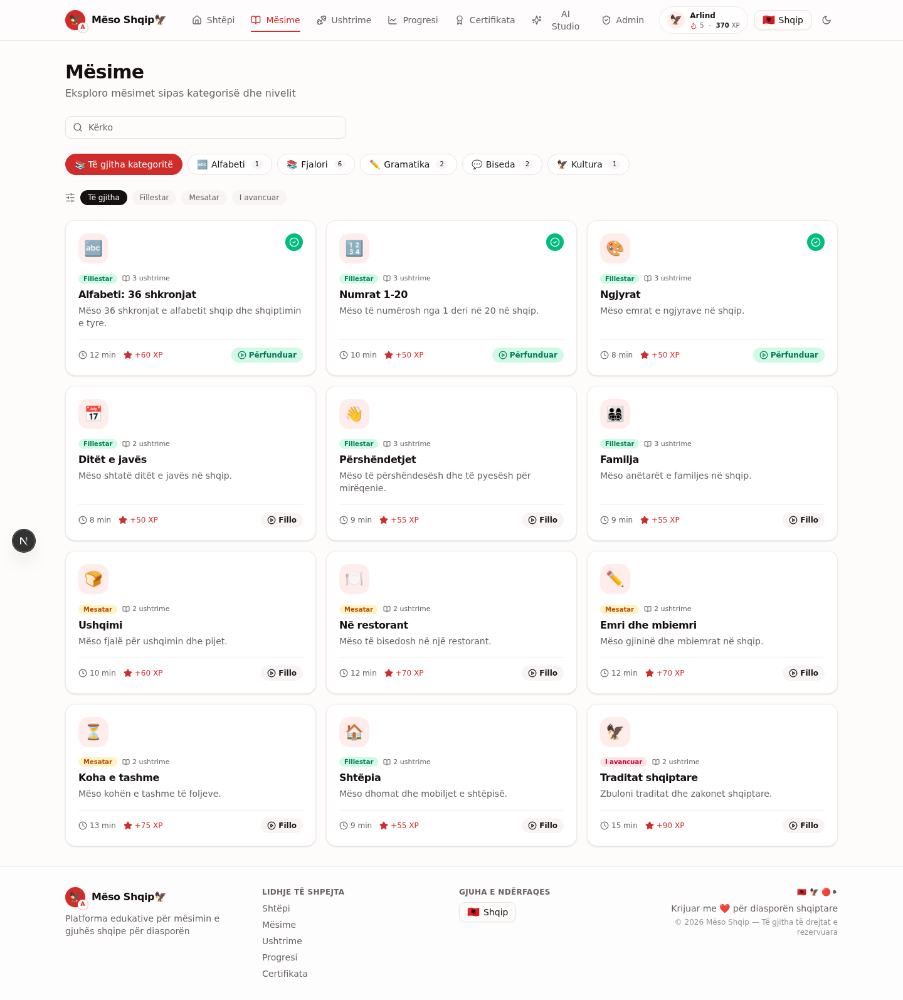
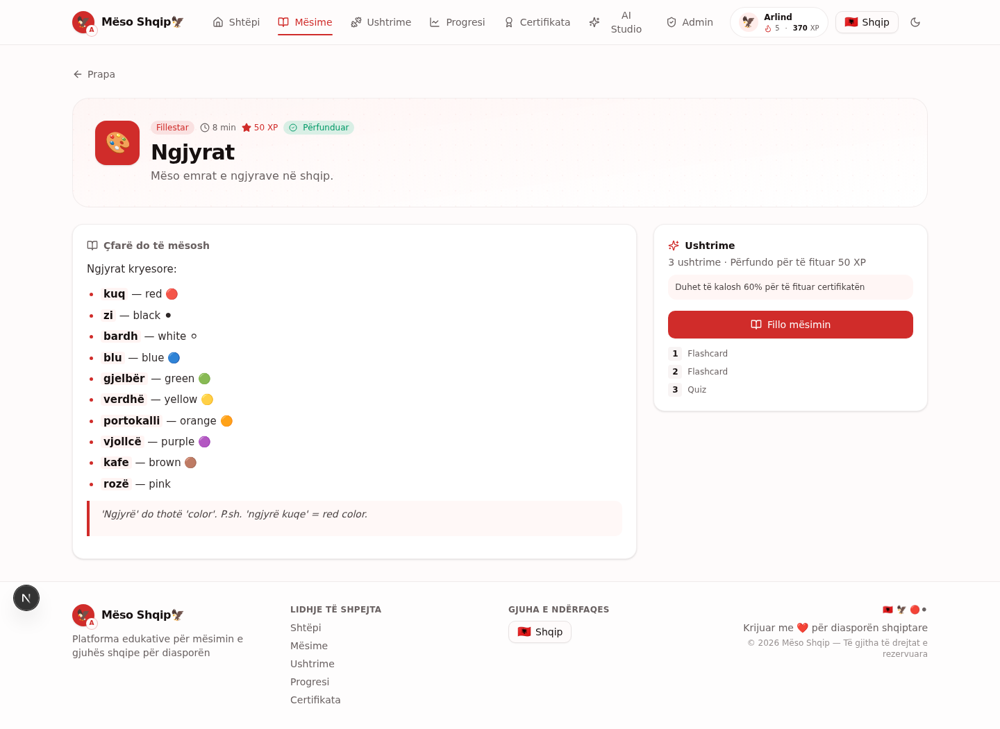
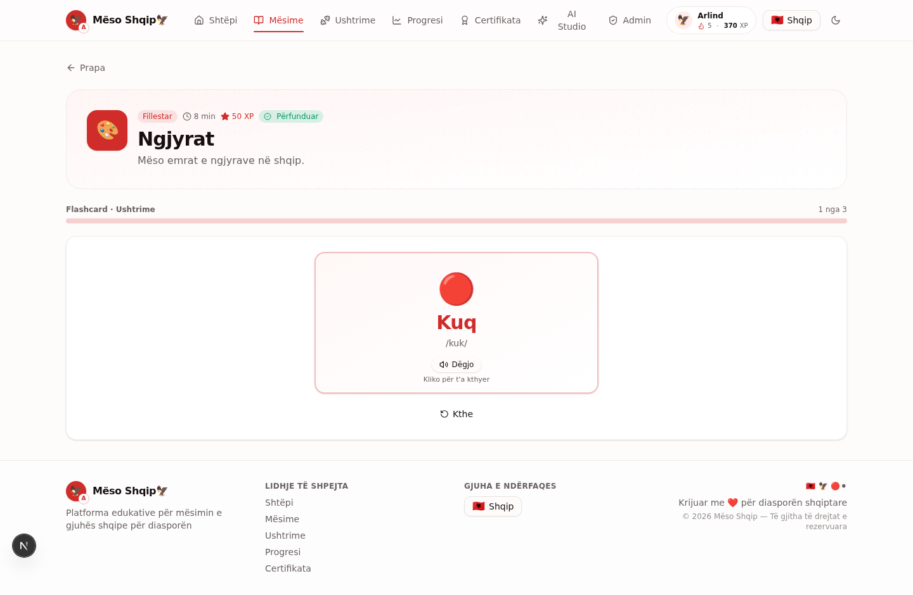
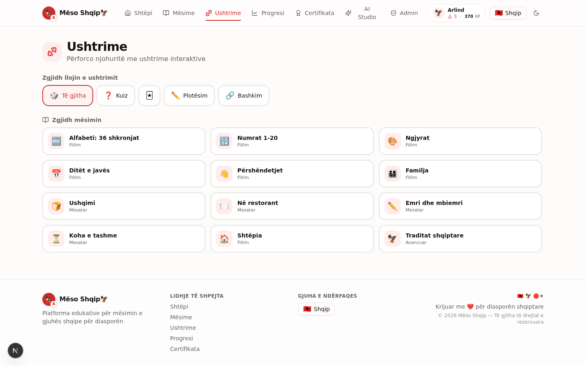
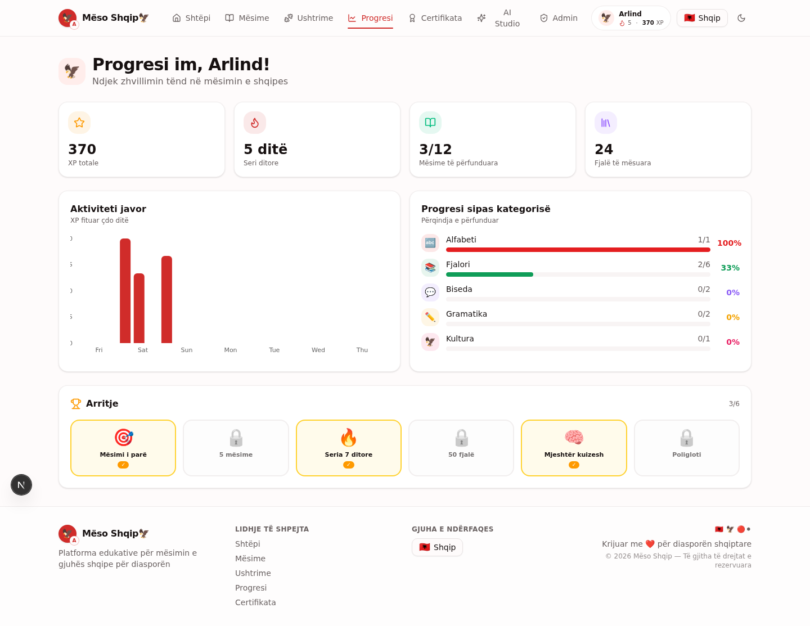
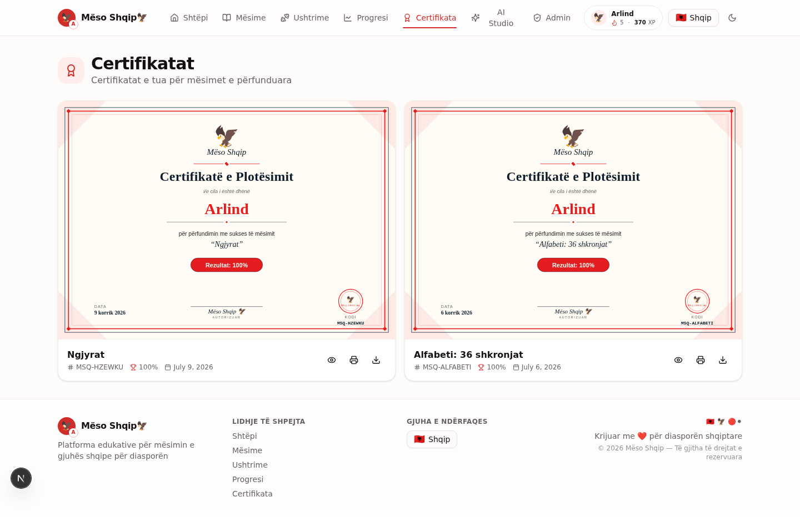
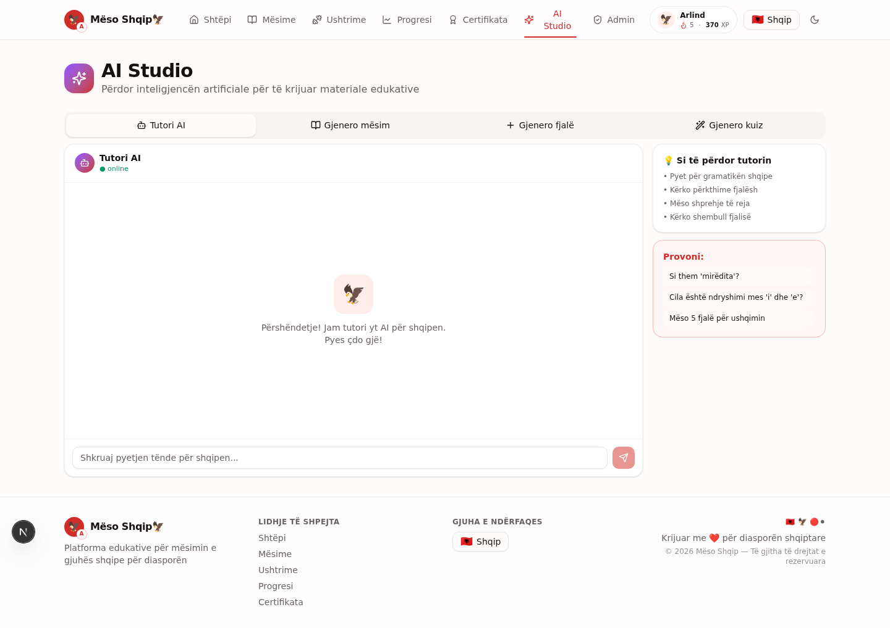
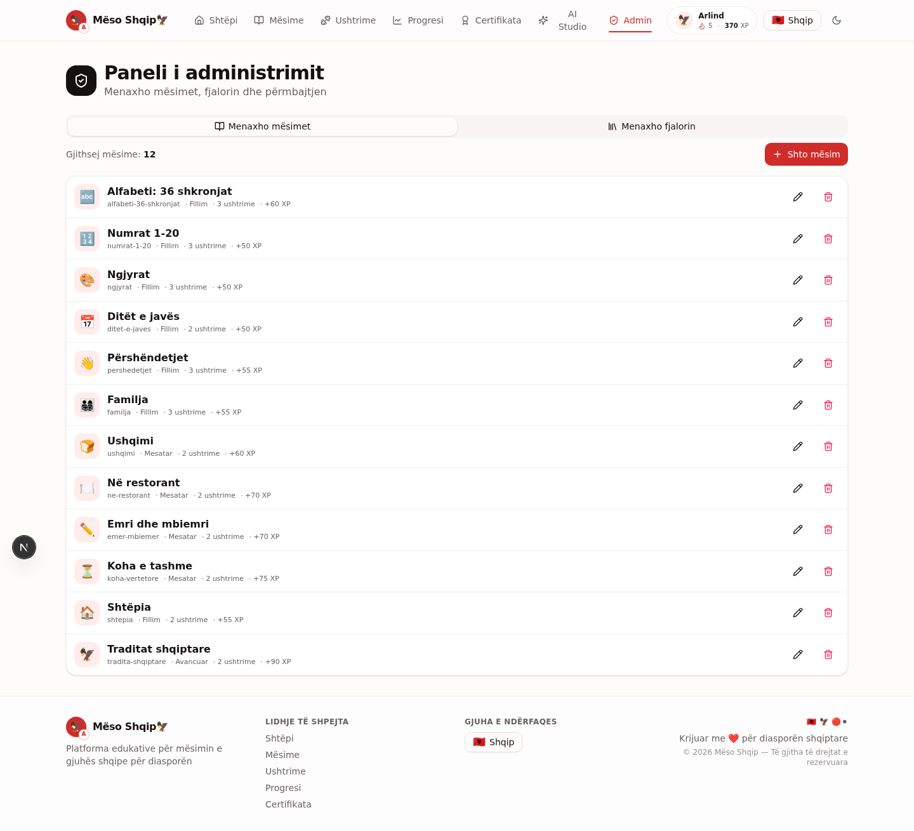
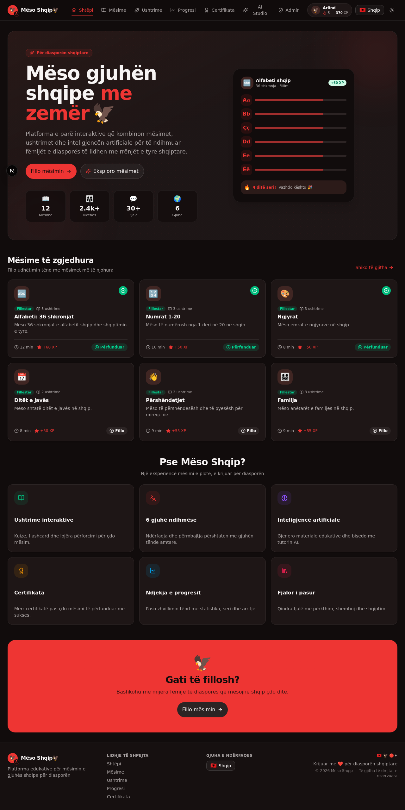

<div align="center">

# Mëso Shqip 🦅

### Platformë edukative interaktive për mësimin e gjuhës shqipe për fëmijët e diasporës shqiptare

**Interactive educational platform for learning the Albanian language for children of the Albanian diaspora**

[](https://nextjs.org/)
[](https://www.typescriptlang.org/)
[](https://www.prisma.io/)
[](https://tailwindcss.com/)
[](https://z.ai)

</div>

---

## 🇦🇱 Shqip

### Për projektin

**Mëso Shqip🦅** është një platformë web e krijuar me qëllim që t'i ndihmojë fëmijët e diasporës shqiptare të mësojnë gjuhën amtare në një mënyrë interaktive dhe moderne. Platforma kombinon mësimet, ushtrimet dhe progresin e përdoruesve për të krijuar një eksperiencë motivuese gjatë procesit të mësimit.

### Funksionalitetet kryesore

- 📚 **Menaxhimi i mësimeve** — Mësime të strukturuara në 5 kategori (Alfabeti, Fjalori, Gramatika, Biseda, Kultura) me 3 nivele vështirësie
- 🎮 **Ushtrime interaktive** — 4 lloje ushtrimesh: kuize, flashcard me shqiptim (Text-to-Speech), plotësim i hapësirave dhe bashkim çiftesh
- 📊 **Ndjekja e progresit** — Statistika të detajuara, grafikë javorë, seri ditore (streak), sisteme XP dhe arritje
- 🌍 **Mbështetje për 6 gjuhë** — Shqip, English, Deutsch, Italiano, Français, Español — ndërfaqja dhe përmbajtja përshtaten plotësisht
- 🏆 **Gjenerimi i certifikatave** — Certifikata të personalizuara SVG pas përfundimit me sukses të çdo mësimi (≥60%)
- ⚙️ **Panel administrimi** — Menaxhim i plotë i mësimeve dhe fjalorit me forma shumëgjuhëshe
- 🤖 **Integrim i AI** — Tutor AI për bisedë, gjenerim automatik i mësimeve, kuizeve dhe fjalëve të reja

### Teknologjitë e përdorura

| Kategori | Teknologjia |
|----------|------------|
| Framework | Next.js 16 (App Router) |
| Gjuha | TypeScript 5 |
| Stili | Tailwind CSS 4 + shadcn/ui |
| Databaza | Prisma ORM + SQLite |
| State | Zustand + TanStack Query |
| AI | z-ai-web-dev-sdk (LLM) |
| Animacione | Framer Motion |
| Grafikë | Recharts |

---

## 🇬🇧 English

### About

**Mëso Shqip🦅** is a web platform designed to help children of the Albanian diaspora learn their mother tongue in an interactive and modern way. The platform combines lessons, exercises, and user progress tracking to create a motivating learning experience.

### Key features

- 📚 **Lesson management** — Structured lessons across 5 categories (Alphabet, Vocabulary, Grammar, Conversation, Culture) with 3 difficulty levels
- 🎮 **Interactive exercises** — 4 exercise types: quizzes, flashcards with pronunciation (Text-to-Speech), fill-in-the-blank, and matching pairs
- 📊 **Progress tracking** — Detailed statistics, weekly charts, daily streaks, XP system, and achievements
- 🌍 **6-language support** — Albanian, English, German, Italian, French, Spanish — UI and content fully adapt
- 🏆 **Certificate generation** — Personalized SVG certificates after successfully completing each lesson (≥60%)
- ⚙️ **Admin panel** — Full management of lessons and dictionary with multilingual forms
- 🤖 **AI integration** — AI tutor for conversation, automatic generation of lessons, quizzes, and new vocabulary words

### Tech stack

| Category | Technology |
|----------|-----------|
| Framework | Next.js 16 (App Router) |
| Language | TypeScript 5 |
| Styling | Tailwind CSS 4 + shadcn/ui |
| Database | Prisma ORM + SQLite |
| State | Zustand + TanStack Query |
| AI | z-ai-web-dev-sdk (LLM) |
| Animations | Framer Motion |
| Charts | Recharts |

---

## 📸 Screenshots

### 🏠 Home page / Faqja kryesore



### 📖 Lessons / Mësimet



### 📝 Lesson detail / Detaji i mësimit



### 🎮 Interactive exercise / Ushtrim interaktiv



### 💪 Practice section / Sektori i ushtrimeve



### 📊 Progress dashboard / Paneli i progresit



### 🏆 Certificates / Certifikatat



### 🤖 AI Studio / Studio AI



### ⚙️ Admin panel / Paneli i administrimit



### 🌙 Dark mode / Mënyra e errët



---

## 🚀 Getting Started / Si të fillosh

### Prerequisites / Parakushtet

- [Node.js](https://nodejs.org/) 18+ or [Bun](https://bun.sh/)
- npm or bun package manager

### Installation / Instalimi

```bash
# Clone the repository
git clone https://github.com/erlisgashi67-commits/Meso-Shqip.git
cd Meso-Shqip

# Install dependencies
bun install
# or
npm install

# Set up the database
bun run db:push
bun run db:generate

# Seed the database with initial data
bun run prisma/seed.ts

# Start the development server
bun run dev
```

The application will be available at `http://localhost:3000`.

### Available scripts / Skriptet e disponueshme

| Command | Description |
|---------|-------------|
| `bun run dev` | Start development server |
| `bun run lint` | Run ESLint |
| `bun run db:push` | Push schema to database |
| `bun run db:generate` | Generate Prisma client |
| `bun run db:migrate` | Run migrations |
| `bun run build` | Build for production |

---

## 📁 Project structure / Struktura e projektit

```
src/
├── app/
│   ├── api/                  # API routes (Next.js App Router)
│   │   ├── ai/               # AI endpoints (generate-lesson, quiz, word, tutor)
│   │   ├── categories/       # Category CRUD
│   │   ├── certificate/      # Certificate SVG generation
│   │   ├── certificates/     # List learner certificates
│   │   ├── dictionary/       # Dictionary CRUD
│   │   ├── learner/          # Learner stats & achievements
│   │   ├── lessons/          # Lesson CRUD + detail
│   │   └── progress/         # Progress tracking
│   ├── globals.css           # Global styles + theme variables
│   ├── layout.tsx            # Root layout
│   └── page.tsx              # Main page (single-page app)
├── components/
│   ├── meso/                 # App-specific components
│   │   ├── exercises/        # Interactive exercise components
│   │   ├── sections/         # Page sections (home, lessons, etc.)
│   │   ├── app-shell.tsx     # Main layout shell
│   │   ├── brand.tsx         # Logo/branding
│   │   ├── exercise-runner.tsx
│   │   └── ...
│   ├── providers.tsx         # Theme + Query client providers
│   └── ui/                   # shadcn/ui components
├── lib/
│   ├── ai.ts                 # AI service (LLM integration)
│   ├── api-helpers.ts        # API mappers & helpers
│   ├── certificate.ts        # SVG certificate generator
│   ├── cert-code.ts          # Certificate code generator
│   ├── db.ts                 # Prisma client
│   ├── format.ts             # Date formatting
│   ├── i18n.ts               # UI strings (6 languages)
│   ├── languages.ts          # Language definitions
│   ├── types.ts              # TypeScript types
│   └── utils.ts              # Utility functions
├── store/
│   └── app.ts                # Zustand state store
└── prisma/
    ├── schema.prisma         # Database schema
    └── seed.ts               # Database seed script
```

---

## 🗄️ Database schema / Skema e databazës

The platform uses the following data models:

- **Learner** — User profile with XP, streak, and avatar
- **Category** — Lesson categories (Alphabet, Vocabulary, etc.)
- **Lesson** — Educational content with multilingual fields (title, summary, content)
- **Exercise** — Interactive exercises (quiz, flashcard, fill, matching)
- **Progress** — Tracks learner progress per lesson (status, score, XP)
- **Dictionary** — Albanian words with translations in 6 languages
- **Certificate** — Issued certificates with unique codes
- **Achievement** — Earned achievements (first lesson, streaks, etc.)

All multilingual content is stored as JSON objects with keys: `sq`, `en`, `de`, `it`, `fr`, `es`.

---

## 🌍 Languages / Gjuhët

| Code | Language | Flag |
|------|----------|------|
| `sq` | Shqip (Albanian) | 🇦🇱 |
| `en` | English | 🇬🇧 |
| `de` | Deutsch (German) | 🇩🇪 |
| `it` | Italiano (Italian) | 🇮🇹 |
| `fr` | Français (French) | 🇫🇷 |
| `es` | Español (Spanish) | 🇪🇸 |

---

## 🤖 AI Integration / Integrimi i AI

The platform integrates AI for:

1. **AI Tutor** — Conversational assistant that answers questions about Albanian language, grammar, and vocabulary
2. **Lesson generation** — Automatically generates complete lessons with content and exercises on any topic
3. **Quiz generation** — Creates custom multiple-choice quizzes
4. **Word generation** — Generates new dictionary entries with translations and examples

AI is powered by `z-ai-web-dev-sdk` and all AI calls happen server-side.

---

## 📜 License

This project is licensed for educational purposes.

---

<div align="center">

**Made with ❤️ for the Albanian diaspora / Krijuar me ❤️ për diasporën shqiptare**

🇦🇱 🦅 🔴 ⚫

</div>
